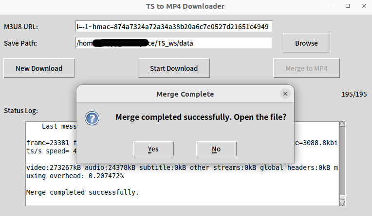

#  introduction

这是一个python视频下载工具，适合在线视频网站xxxhub，只需要在浏览器中找到.m3u8地址或者 任意一个.ts片段的地址

"This is a video download tool suitable for online video websites. You just need to find the .m3u8 address or the address of any .ts segment in the browser."

# dependencies

- python3
- ffmpeg
- tkinter

- test on ubuntu 22.04, may be work on other linux distros or windows.


# how to use

## 1. run python script
```
python3 xxxhub_downloader.py

```


## 2. get the url

use browser right click->inspect->media

copy the m3u8 url or .ts file url


## 3. fill the url to M3U8 URL position and save path
## 4. click start_download


## 5. wait for all .ts files to be downloaded, click Merge to MP4



## 7. check the mp4 file in the path


# if it helps you, please give a star

